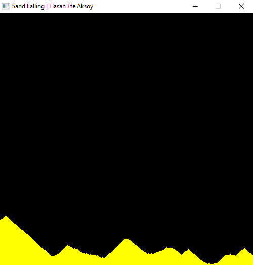

Sand Falling 2D
<br>
The project used only the glfw library. Not glew, glut etc.
<br>
<br>
Controls: <b> You can left click to leave sand, right click to clear all sands.</b>
<br>
<br>
The sands are mini rectangle here. And the window is divided into grids. Grids is ```int grids[columnCount][rowCount]```
<br>
In a for loop, it checks <b>"is grids[i][j] 1 or 0. If its 1 draw and checks next row. If that is 1 too, go right or left."</b>.
<br>
<br>
<h4>Preview:</h4>
<br>


<br>


